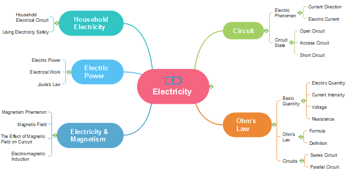

# Hierarchical note taking app



## Features

* Nested notes displayed like mindmaps
* Each note can have multiple child notes connected to it.
* Supports rich formatting features.
* Notes can be moved around.
* The view is restricted to depth of three.
* A collection of notes are rooted at a 'book'.
* Books can be public or private
* Public books can be seen by anyone. They can be upvoted, downvoted, and commented on.
* There will be a news feed showing popular books. Popularity = speed of books = upvotes/time.

# Notes


### Index of my books

```
GET /books/
```

### Index of only public/private books

```
GET /books/public/
GET /books/private/
```

### Create/update/delete/view a book

```
POST,PATCH,DELETE,GET /books/
```


### View a user's books

```
GET /books/username/
```


### Add/update/delete a new note to a book

```
POST,PATCH,DELETE /books/note/
```


### View a note

```
GET /notes/
```


# Feed

### View feed

```
GET /feed/
```

### Sort feed by tag

```
GET /feed/tag/
```


### Upvote/Downvote book

```
PATCH /books/upvote/
PATCH /books/downvote/
```


### Comment on book

```
POST /books/comment/
```


### Subscribe/unsub to a new tag

```
POST, DELETE /tags/
```


### Add note to favourite

```
POST /favourites/
```


### View my favourite tags

```
GET /favourites/
```
