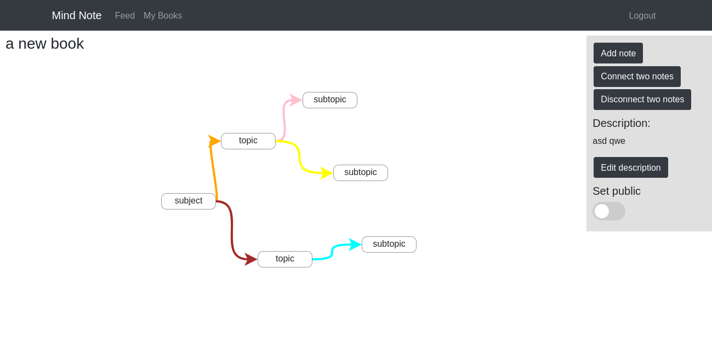

# Hierarchical note taking app

## Organize notes



## Create notes


## Feed


## Features

### Tech stack - Django, ReactJS, MySQL, Docker, Ansible, ELK, Github Actions.

### Application

* Nested notes displayed like mindmaps.
* Each note can have multiple child notes connected to it.
* Supports rich formatting features.
* Notes can be dragged around.
* Collection of notes can be saved as 'Books'.
* Books can be public or private
* Public books can be seen by anyone and be commented on.

### Deployment

* Containerization with docker for easy replication and deployment.
* Github actionos auto-deploys to Microsoft Azure using Ansible.
* ELK stack monitors logs for faults.

# Notes


### Index of my books

```
GET /books/
```

### Index of only public/private books

```
GET /books/public/
GET /books/private/
```

### Create/update/delete/view a book

```
POST,PATCH,DELETE,GET /books/
```


### View a user's books

```
GET /books/username/
```


### Add/update/delete a new note to a book

```
POST,PATCH,DELETE /books/note/
```


### Connect two notes

```
PATCH /notes/connect/
```


### View a note

```
GET /notes/
```


# Feed

### View feed

```
GET /feed/
```

### Sort feed by tag

```
GET /feed/tag/
```


### Comment on book

```
POST /books/comment/
```


### View my favourite books

```
GET /favourites/
```
